# LangSearch × LangExtract × Google Gemini

A visually rich, AI-powered web search experience. Type a query, get an instant, structured AI summary from Google's LangExtract (powered by Gemini), followed by high-quality web results from LangSearch.

---

## 🌐 Product Snapshot

| Feature | Description |
|---|---|
| 🔎 Web Search | `LangSearch` REST API via `pages/api/search.js` |
| 🤖 AI Summary | `LangExtract` Python service with `Google Gemini` via `python-backend/langextract_service.py` |
| 🖥️ Frontend | Modern `Next.js` UI at `pages/index.tsx` with `AIChatInput` |
| 🔌 Bridge | Next.js API route `pages/api/langextract.js` connects FE → Python |
| ⚙️ Config | `.env.local` for API keys, `setup.bat` and `start-services.bat` for Windows |

---

## 🧭 Architecture at a Glance


---

## 📊 System Flow (Journey)

```mermaid
journey
  title Search → Summarize → Explore
  section Input
    Type question: 5: User
    Hit Send: 5: User
  section Retrieval
    Fetch web results (LangSearch): 4: System
  section Understanding
    Summarize with LangExtract + Gemini: 5: System
  section Presentation
    Render AI Summary (top): 5: Frontend
    Render Web Results (below): 5: Frontend
```



---

## 🧩 Core Modules

| Path | Purpose |
|---|---|
| `pages/index.tsx` | Orchestrates query, shows AI summary first, then results |
| `pages/api/search.js` | Proxies LangSearch API and normalizes data |
| `pages/api/langextract.js` | Calls Python summarizer with query + results |
| `python-backend/langextract_service.py` | Flask app using LangExtract + Gemini |
| `components/ui/ai-chat-input.tsx` | Polished chat-like search input |

---

## ⚙️ Environment Variables

| Variable | Where | Description |
|---|---|---|
| `LANGSEARCH_API_KEY` | `.env.local` | Required for LangSearch web results |
| `LANGSEARCH_BASE_URL` | `.env.local` | Defaults to `https://api.langsearch.com` |
| `GEMINI_API_KEY` | `.env.local` and/or `python-backend/.env` | Required for LangExtract + Gemini |
| `PYTHON_SERVICE_URL` | `.env.local` | Defaults to `http://localhost:5000` |

Quick start template (`.env.local`):

```env
LANGSEARCH_API_KEY=your_langsearch_api_key
LANGSEARCH_BASE_URL=https://api.langsearch.com
GEMINI_API_KEY=your_gemini_api_key
PYTHON_SERVICE_URL=http://localhost:5000
```

Optional Python `.env` (inside `python-backend/`):
```env
GEMINI_API_KEY=your_gemini_api_key
PORT=5000
```

---

## 🧪 API Surfaces

### Next.js → LangSearch
- Route: `POST /api/search`
- Body:
```json
{
  "query": "What is LangSearch?",
  "count": 5,
  "freshness": "noLimit",
  "summary": true
}
```
- Returns: normalized `results[]`, optional `summary`, and `raw`.

### Next.js → Python (LangExtract)
- Route: `POST /api/langextract`
- Body (UI forwards LangSearch results):
```json
{
  "query": "What is LangSearch?",
  "results": [{ "title": "...", "url": "...", "snippet": "..." }]
}
```
- Returns:
```json
{
  "success": true,
  "query": "...",
  "summary": {
    "main_topic": "...",
    "key_points": ["..."],
    "comprehensive_summary": "...",
    "key_entities": ["..."],
    "main_conclusion": "..."
  },
  "formatted_text": "markdown-friendly string"
}
```

---

## 🛠️ Install & Run (Windows)

1) Install Node and Python dependencies
```bash
# Python
cd python-backend
pip install -r requirements.txt

# Node (from repo root)
npm install
```

2) Configure environment
- Copy `.env.local.example` → `.env.local`
- Fill in keys for LangSearch and Gemini

3) Start services
```bash
# Option A: scripts
./start-services.bat

# Option B: manual
# terminal 1
cd python-backend && set GEMINI_API_KEY=your_key && python langextract_service.py
# terminal 2
npm run dev
```

Open http://localhost:3000

---

## 🖼️ UI Layout

```mermaid
flowchart TB
  UI[Search Screen]
  subgraph Summary First
    A[🤖 LangExtract Summary]
  end
  subgraph Results Below
    B[🔗 Web Results Cards]
  end
  UI --> A --> B
```



---

## 📦 Tech Stack

| Layer | Tools |
|---|---|
| Frontend | Next.js 14, React 18, Tailwind CSS, Motion |
| Backend (Node) | Next.js API Routes |
| AI Extraction | LangExtract (Google), Gemini 1.5 (Flash/Pro) |
| Python Server | Flask + CORS |

---

## 🔐 Security Notes

- Do not commit `.env.local` or API keys
- Use different keys per environment
- In production, place the Python service behind your API gateway or VPC

---

## 🧭 Directory Map

```text
next-langsearch/
├─ components/ui/
│  ├─ ai-chat-input.tsx
│  └─ ...
├─ pages/
│  ├─ api/
│  │  ├─ search.js         # LangSearch proxy
│  │  └─ langextract.js    # FE → Python bridge
│  ├─ index.tsx            # Orchestrates UI
│  └─ _app.tsx
├─ python-backend/
│  ├─ langextract_service.py
│  └─ requirements.txt
├─ styles/
├─ .env.local.example
├─ start-services.bat
└─ README.md
```

---

## 📈 Example Summary View (Schema)


---

## 🙏 Acknowledgements

- Thanks to **LangSearch** for robust, developer-friendly web search APIs.
- Thanks to **LangExtract** for elegant schema-driven information extraction.
- Thanks to **Google Gemini** for powering high-quality AI understanding.

---

## 🧭 Troubleshooting Quick Table

| Symptom | Check |
|---|---|
| No summary appears | Python service running at `http://localhost:5000/health`? `GEMINI_API_KEY` set? |
| `500` from `/api/langextract` | Python logs in `langextract_service.py` and CORS |
| `Missing LANGSEARCH_API_KEY` | Add to `.env.local` |
| Port in use | Change `PORT` in `python-backend/.env` or stop conflicting service |

---

## 📜 License

This project integrates with Google’s LangExtract library and Gemini models. Review their licenses and usage policies before production use.
